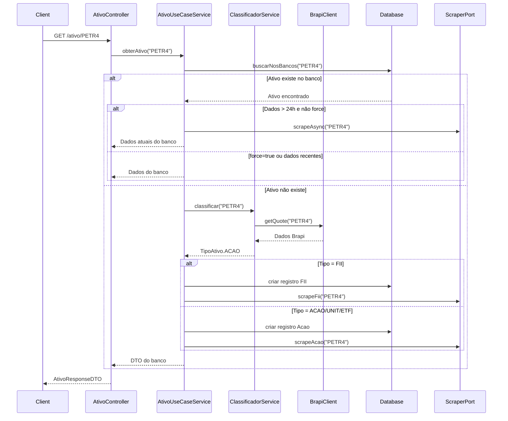

# Resumo Executivo - Migração API Unificada

## 🎯 Objetivo

Refatorar o sistema **Ticker Scraper** para implementar uma API unificada que integra com a **API Brapi** para classificação automática de ativos financeiros, mantendo os princípios da **Arquitetura Hexagonal**.

## 📊 Situação Atual vs. Situação Desejada

### Estado Atual ✅

- ✅ **Arquitetura Hexagonal** bem implementada
- ✅ **Scraping funcional** para ações e FIIs
- ✅ **APIs REST separadas**: `/acao/{ticker}` e `/fii/{ticker}`
- ✅ **Cache inteligente** (24h de validade)
- ✅ **Resiliência** com Resilience4j
- ✅ **Programação reativa** com WebFlux
- ✅ **Auditoria completa** com dados brutos JSON

### Estado Desejado 🎯

- 🎯 **API unificada**: `GET /ativo/{codigo}`
- 🎯 **Classificação automática** via Brapi
- 🎯 **Endpoint de classificação**: `GET /classifica/{codigo}`
- 🎯 **Coluna tipo_codigo** nas tabelas
- 🎯 **Integração externa** com retry/backoff
- 🎯 **Regras de negócio** para classificação

## 🏗️ Arquitetura da Solução

### Componentes Novos

```
DOMAIN
├── TipoAtivo.java (enum: ACAO, UNIT, FII, ETF, DESCONHECIDO)
├── FonteClassificacao.java (enum: BRAPI, HEURISTICA, MANUAL)
└── CodigoAtivoNaoEncontradoException.java

APPLICATION
├── port/output/ClassificadorAtivoPort.java
├── port/input/AtivoUseCasePort.java
├── service/ClassificadorAtivoService.java
├── service/AtivoUseCaseService.java
└── dto/ClassificacaoResult.java, AtivoResponseDTO.java

ADAPTERS
├── input/web/AtivoController.java
├── input/web/ClassificacaoController.java
└── output/http/BrapiHttpClient.java

INFRASTRUCTURE
├── config/BrapiConfig.java
└── http/brapi/dto/BrapiQuoteResponse.java
```

### Fluxo da API Unificada



## 🚀 Plano de Implementação

### Fase 1: Preparação (1-2 dias)
- [ ] **Migração Flyway**: Adicionar coluna `tipo_codigo`
- [ ] **Enums de domínio**: `TipoAtivo`, `FonteClassificacao`
- [ ] **Atualizar entidades JPA**: Incluir nova coluna
- [ ] **Testes de migração**: Validar schema

### Fase 2: Integração Brapi (2-3 dias)
- [ ] **DTOs Brapi**: `BrapiQuoteResponse`, `BrapiQuoteResult`
- [ ] **Cliente HTTP**: Com retry, timeout e jitter
- [ ] **Configurações**: Properties e beans Spring
- [ ] **Testes unitários**: Mock da API Brapi

### Fase 3: Classificação (2-3 dias)
- [ ] **Port de classificação**: `ClassificadorAtivoPort`
- [ ] **Serviço de classificação**: Regras de negócio
- [ ] **Endpoint classificação**: `GET /classifica/{codigo}`
- [ ] **Testes de regras**: Cenários de classificação

### Fase 4: API Unificada (3-4 dias)
- [ ] **DTO unificado**: `AtivoResponseDTO`
- [ ] **Port unificado**: `AtivoUseCasePort`
- [ ] **Serviço unificado**: `AtivoUseCaseService`
- [ ] **Controller unificado**: `GET /ativo/{codigo}`
- [ ] **Testes de integração**: Fluxo completo

### Fase 5: Finalização (1-2 dias)
- [ ] **Documentação API**: OpenAPI/Swagger
- [ ] **Testes de performance**: Carga e stress
- [ ] **Monitoramento**: Métricas e logs
- [ ] **Deploy**: Ambiente de produção

**Total Estimado**: 9-14 dias úteis

## 🔧 Regras de Negócio

### Normalização
- **Código**: `uppercase().trim()`
- **Exemplo**: `"  petr4  "` → `"PETR4"`

### Classificação (Ordem de Prioridade)

1. **Sufixo 11**: Candidato a FII/ETF/UNIT
   - Consultar Brapi `GET /api/quote/{codigo}`
   - Analisar `shortName` + `longName`:
     - Contém "FII" → **FII**
     - Contém "UNT" ou "UNIT" → **UNIT**
     - Contém "ETF", "INDEX", "ÍNDICE", "Fundo de Índice", "iShares", "Trend" → **ETF**
     - Sem marcadores → **UNIT** (heurística)

2. **Não termina com 11**: **ACAO**

3. **Brapi falha/vazio**: Usar heurística acima

### Persistência do Tipo
- **Fonte confiável** (Brapi): Persistir `tipo_codigo`
- **Fonte heurística**: Manter `DESCONHECIDO` no banco

### Cache e Scraping
- **Dados > 24h**: Disparar scraping assíncrono
- **Force=true**: Disparar scraping síncrono
- **Novo ativo**: Classificar → Criar → Scraping → Retornar

## ⚠️ Riscos e Mitigações

### Riscos Técnicos

| Risco | Probabilidade | Impacto | Mitigação |
|-------|---------------|---------|----------|
| **API Brapi indisponível** | Média | Alto | Fallback para heurística + Circuit breaker |
| **Rate limit Brapi** | Alta | Médio | Retry com backoff + Cache local |
| **Migração de dados** | Baixa | Alto | Backup + Rollback plan + Testes |
| **Performance degradada** | Média | Médio | Índices no banco + Cache + Async |
| **Classificação incorreta** | Média | Médio | Logs detalhados + Endpoint manual |

### Riscos de Negócio

| Risco | Probabilidade | Impacto | Mitigação |
|-------|---------------|---------|----------|
| **Downtime durante deploy** | Baixa | Alto | Deploy blue-green + Feature flags |
| **Dados inconsistentes** | Média | Alto | Validação + Reconciliação batch |
| **Custo API Brapi** | Baixa | Médio | Monitoramento + Limites |

## 📊 Métricas de Sucesso

### Técnicas
- **Tempo de resposta**: < 500ms (p95)
- **Disponibilidade**: > 99.5%
- **Taxa de erro**: < 1%
- **Classificação correta**: > 95%

### Negócio
- **Redução de endpoints**: 2 → 1 (50%)
- **Automação de classificação**: 100%
- **Cobertura de ativos**: Ações + FIIs + ETFs + Units

## 🛠️ Configurações Necessárias

### Variáveis de Ambiente
```bash
# API Brapi
BRAPI_TOKEN=seu_token_aqui
BRAPI_BASE_URL=https://brapi.dev/api

# Timeouts
BRAPI_CONNECT_TIMEOUT=2s
BRAPI_READ_TIMEOUT=2s

# Retry
BRAPI_MAX_ATTEMPTS=3
BRAPI_INITIAL_DELAY=200ms
BRAPI_MULTIPLIER=2.0
```

### Dependências Maven
```xml
<!-- Já existentes no projeto -->
<dependency>
    <groupId>org.springframework.boot</groupId>
    <artifactId>spring-boot-starter-webflux</artifactId>
</dependency>
<dependency>
    <groupId>io.github.resilience4j</groupId>
    <artifactId>resilience4j-spring-boot3</artifactId>
</dependency>
```

## 📋 Checklist Final

### Pré-Implementação
- [ ] **Token Brapi** obtido e configurado
- [ ] **Backup do banco** realizado
- [ ] **Ambiente de testes** preparado
- [ ] **Plano de rollback** definido

### Durante Implementação
- [ ] **Testes unitários** > 80% cobertura
- [ ] **Testes de integração** passando
- [ ] **Logs estruturados** implementados
- [ ] **Métricas** configuradas

### Pós-Implementação
- [ ] **Documentação** atualizada
- [ ] **Monitoramento** ativo
- [ ] **Alertas** configurados
- [ ] **Treinamento** da equipe

## 🎉 Benefícios Esperados

### Para Desenvolvedores
- **API única** para todos os ativos
- **Classificação automática** reduz trabalho manual
- **Código mais limpo** com responsabilidades claras
- **Melhor testabilidade** com mocks da API externa

### Para Usuários
- **Experiência unificada** de consulta
- **Resposta mais rápida** com cache inteligente
- **Maior cobertura** de tipos de ativos
- **Dados mais confiáveis** com validação externa

### Para o Sistema
- **Arquitetura mais robusta** com integração externa
- **Melhor observabilidade** com métricas detalhadas
- **Maior resiliência** com circuit breakers
- **Escalabilidade** preparada para novos tipos

---

**Conclusão**: A migração proposta mantém a excelente arquitetura existente enquanto adiciona funcionalidades essenciais de forma incremental e segura. O projeto está bem estruturado para receber essas melhorias sem grandes refatorações.

**Próximo Passo**: Aprovação do plano e início da Fase 1 (Preparação).

---

**Autor**: Engenheiro Java Spring Boot  
**Data**: Janeiro 2025  
**Versão**: 1.0